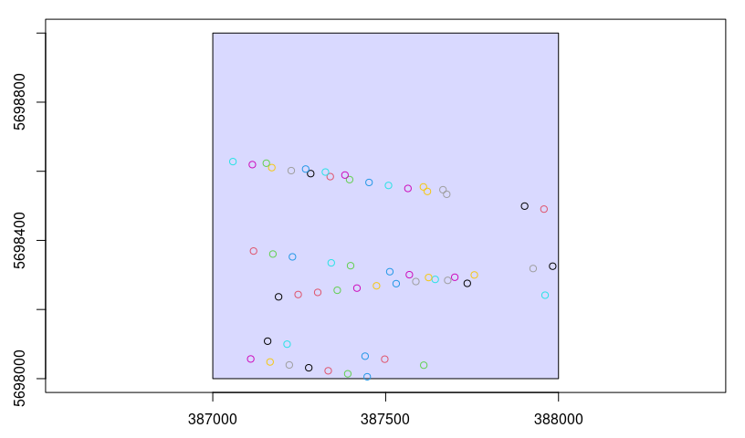
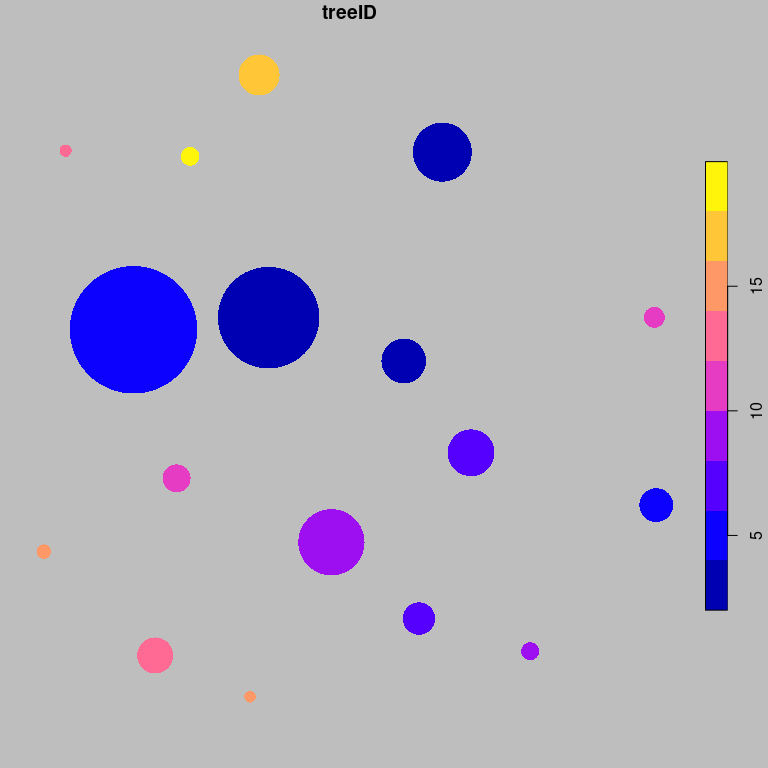
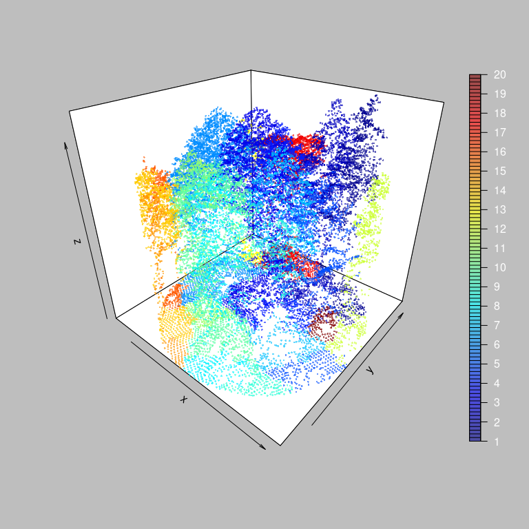
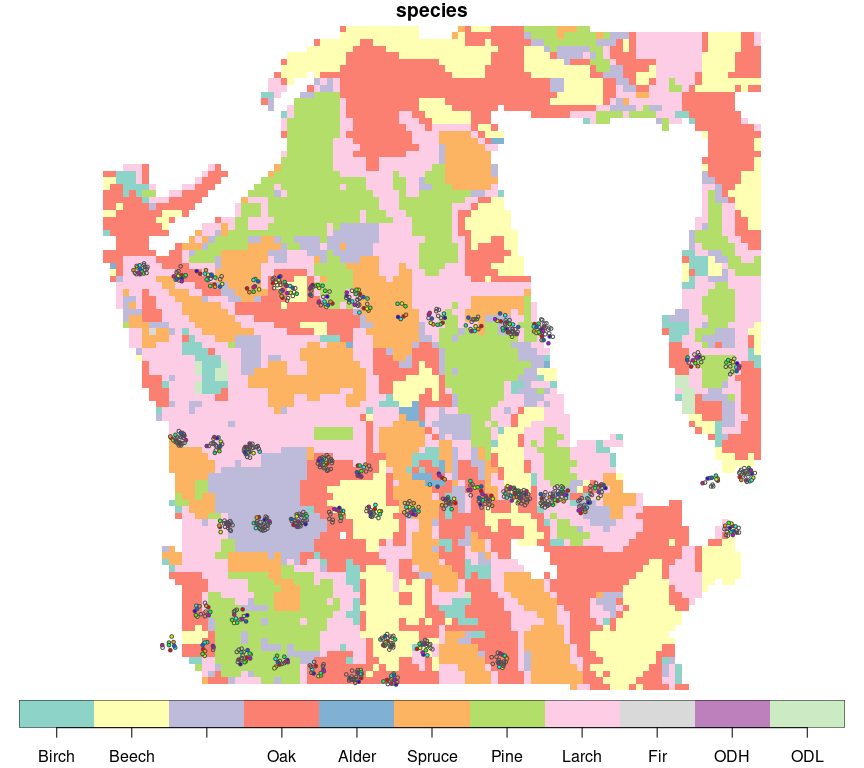
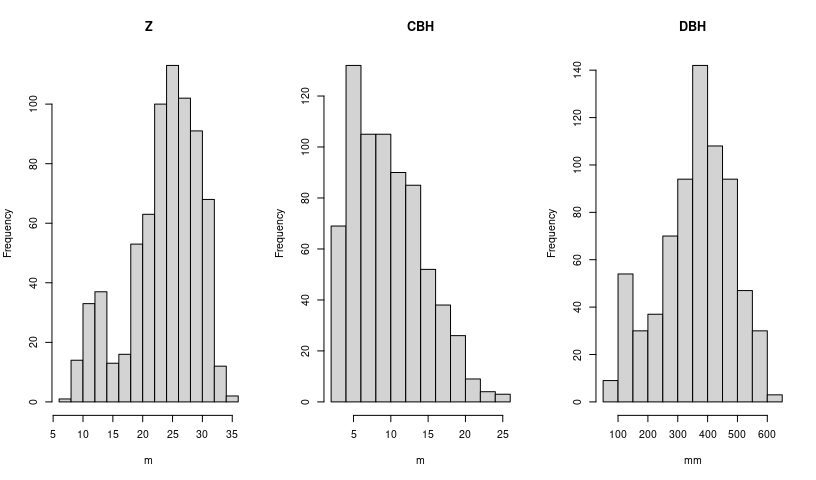

Process ALS point clouds to tree-level structure metrics
================
Johannes Heisig

- [Process tree-level metrics](#process-tree-level-metrics)
  - [ALS data](#als-data)
  - [GEDI locations](#gedi-locations)
  - [Tree-level metrics](#tree-level-metrics)
  - [Check example results](#check-example-results)
  - [Gather metrics](#gather-metrics)
  - [Add species label](#add-species-label)
  - [Handle missing species labels](#handle-missing-species-labels)
- [Prepare tree lists for Fuel Calc](#prepare-tree-lists-for-fuel-calc)
  - [DBH and Crown Class](#dbh-and-crown-class)
  - [Export to FuelCalc](#export-to-fuelcalc)

``` r
# packages
library(sf)
library(stars)
library(lidR)
library(dplyr)
library(mapview)
library(tictoc)
library(pbmcapply)
library(readr)
library(purrr)
library(tidymodels)

# directories and functions
metrics_dir = "data/ALS/metrics"
als_dir = "data/ALS/als_clips"
fc_dir = "data/FuelCalc"
for (d in c(metrics_dir, als_dir, fc_dir)) if (!dir.exists(d)) dir.create(d, recursive = T)
source("R/00_lidar_metrics.R")

# species raster
species_codes = read.csv("data/Raster/tree_species_code.csv")
tree_spec = read_stars("data/Raster/species_10m.tif") |> 
  setNames("species") |> 
  mutate(species = factor(species, levels = species_codes$ID, 
                          labels = species_codes$name))
```

# Process tree-level metrics

## ALS data

Download an open LiDAR tile from the state of Northrhine-Westphalia.

``` r
als_file = "data/ALS/ALS_demo_tile.laz"

if (!file.exists(als_file)){
  url = "https://www.opengeodata.nrw.de/produkte/geobasis/hm/3dm_l_las/3dm_l_las/3dm_32_387_5698_1_nw.laz"
  download.file(url, als_file)
}
```

Read ALS tile(s) into a catalog object. This demo uses just one tile,
but you can provide multiple file names. Select only attributes of
interest to save memory. In case of neighboring tiles, apply a buffer to
prevent edge problems.

``` r
ctg = readLAScatalog(als_file, select = "xyzc")
opt_chunk_size(ctg) = 100
```

    ## Be careful, a chunk size smaller than 250 is likely to be irrelevant.

``` r
opt_chunk_buffer(ctg) = 15
opt_select(ctg) = "xyzc"
summary(ctg)
```

    ## class       : LAScatalog (v1.2 format 1)
    ## extent      : 387000, 388000, 5698000, 5699000 (xmin, xmax, ymin, ymax)
    ## coord. ref. : ETRS89 / UTM zone 32N 
    ## area        : 1 km²
    ## points      : 40.76 million points
    ## density     : 40.8 points/m²
    ## density     : 17.4 pulses/m²
    ## num. files  : 1 
    ## proc. opt.  : buffer: 15 | chunk: 100
    ## input opt.  : select: xyzc | filter: 
    ## output opt. : in memory | w2w guaranteed | merging enabled
    ## drivers     :
    ##  - Raster : format = GTiff  NAflag = -999999  
    ##  - stars : NA_value = -999999  
    ##  - SpatRaster : overwrite = FALSE  NAflag = -999999  
    ##  - SpatVector : overwrite = FALSE  
    ##  - LAS : no parameter
    ##  - Spatial : overwrite = FALSE  
    ##  - sf : quiet = TRUE  
    ##  - data.frame : no parameter

## GEDI locations

Serve as plot locations.

``` r
g = st_read("data/GEDI/GEDI_demo_subset.gpkg", quiet=T) |> 
  select(uniqueID) |> 
  st_transform(st_crs(ctg$geometry))

plot(ctg, map=F) 
plot(g["uniqueID"], col=1:nrow(g), add=T)
```

<!-- -->

## Tree-level metrics

Process point clouds to tree-level structure metrics, including tree
height, tree base height, and position.

1.  clip at GEDI coordinate with 12.5 m radius
2.  normalize height using a ground surface that is modeling useing a
    Kriging method (40 nearest neighbors)
3.  segment individual trees using a region growing algorithm
4.  derive tree level height metrics (max height and crown base height)

This routine is run in parallel to save time. It ouputs the segmented
point cloud (`.las`) and the georeferenced metrics (`.gpkg`).

``` r
tic()
metrics_list = pbmclapply(1:nrow(g), process_tlm2, gedi = g, .ctg = ctg, 
           alsdir = als_dir, mdir = metrics_dir, mc.cores = 4)
toc() # ~ 30 min
```

    ## 0.05 sec elapsed

## Check example results

``` r
sample_uID = 1145111
sample_metrics = st_read(paste0(metrics_dir, "/uID_", sample_uID, ".gpkg"), quiet = T)
sample_als = readLAS(paste0(als_dir, "/uID_", sample_uID, ".las"))

# map
par(bg = 'grey', fg = 'black')
plot(sample_metrics["treeID"], pch = 16, cex = sample_metrics$share*100)
```

<!-- -->

``` r
# trees
plot3D::scatter3D(sample_als$X, sample_als$Y, sample_als$Z, 
                 colvar = sample_als$treeID, phi=30, pch = 16, 
                 cex=0.4, alpha = 0.6, col.panel = "black",
                 colkey = list(at = 1:max(sample_als$treeID),
                               side = 4, addlines = TRUE,
                               length = 0.9, width = 0.7,
                               labels = 1:max(sample_als$treeID),
                               col.axis = "white", col.clab = "white"))
```

<!-- -->

## Gather metrics

``` r
files_metrics = list.files(metrics_dir, full.names = T)
files_als = list.files(als_dir, full.names = T)

ids_metrics = parse_number(basename(files_metrics))
ids_als = parse_number(basename(files_als))
identical(ids_als, ids_metrics)
```

    ## [1] TRUE

``` r
read_with_id = function(path){
  id = parse_number(basename(path))
  m = st_read(path, quiet=T)
  m$uniqueID = id
  return(select(m, uniqueID, treeID, Z = Zmax, everything()))
}

metrics = map_dfr(files_metrics, read_with_id) |> 
  st_transform(st_crs(tree_spec))
```

## Add species label

Display tree locations on species raster and extract.

``` r
metrics$species = st_extract(tree_spec, metrics) |> pull(1)
summary(metrics$species) # 69 species labels missing
```

    ##       Birch       Beech Douglas_Fir         Oak       Alder      Spruce 
    ##          13          91          99         252           1          71 
    ##        Pine       Larch         Fir         ODH         ODL        NA's 
    ##          92         238           2           0           0          69

``` r
plot(tree_spec, key.pos=1, key.length = 1, reset=F)
plot(metrics, pch = 21, bg = rainbow(10)[metrics$treeID], 
     col = "grey30", cex = 0.5, add=T)
```

<!-- -->

## Handle missing species labels

Find dominant species per plot.

``` r
dominant_species = metrics |> 
  st_drop_geometry() |> 
  group_by(uniqueID) |> 
  count(species) |> 
  summarise(Ndom = sum(n), dom_spec = species[which.max(n)], 
            perc_dom = n[which.max(n)]/Ndom, 
            Nna = sum(is.na(species)),
            perc_na = Nna/Ndom, .groups = "drop") 

summary(dominant_species[,2:6])
```

    ##       Ndom          dom_spec     perc_dom           Nna       
    ##  Min.   : 6.00   Oak    :16   Min.   :0.3077   Min.   :0.000  
    ##  1st Qu.:13.00   Larch  :14   1st Qu.:0.5971   1st Qu.:0.000  
    ##  Median :16.00   Pine   : 6   Median :0.8013   Median :0.000  
    ##  Mean   :16.57   Beech  : 5   Mean   :0.7632   Mean   :0.125  
    ##  3rd Qu.:19.25   Spruce : 5   3rd Qu.:1.0000   3rd Qu.:0.000  
    ##  Max.   :29.00   (Other): 4   Max.   :1.0000   Max.   :1.000  
    ##                  NA's   : 6                                   
    ##     perc_na       
    ##  Min.   :0.00000  
    ##  1st Qu.:0.00000  
    ##  Median :0.00000  
    ##  Mean   :0.00879  
    ##  3rd Qu.:0.00000  
    ##  Max.   :0.11111  
    ## 

Insert dominant species label where missing.

``` r
metrics_complete = inner_join(metrics, select(dominant_species, uniqueID, dom_spec), 
                              by = "uniqueID") |> 
  mutate(species = case_when(is.na(species) ~ dom_spec, TRUE ~ species)) |> 
  filter(sum(is.na(species)) == 0, .by = uniqueID)
```

# Prepare tree lists for Fuel Calc

## DBH and Crown Class

Predict diameter at breast height (DBH) with pre-trained models based on
German national forest inventory data.

``` r
DBHmodels = readRDS("data/ALS/DBH_models.rds")

for (i in 1:nrow(DBHmodels)){
  S = DBHmodels$species[i]
  metrics_complete$DBH[metrics_complete$species == S] = 
    predict(DBHmodels$fit_wf[[i]], 
            filter(metrics_complete, species == S) |> 
              select(Z)) |> 
    pull() |> round()
}
```

Infer Crown Class based on top position within canopy. Can be dominant
(D), co-dominant (C), or suppressed (S).

``` r
crcl = function(Z){
  if (length(Z) == 1){
    return(c(cl = as.factor("D")))
  } else{
  m = mean(Z, na.rm=T)
  s = sd(Z, na.rm=T)
  up = m + s
  lo = m - s 
  cut(Z, breaks = c(0, lo, up, 100), labels = c("S","C","D"))
  }
}

metrics_complete$CrCl = group_by(metrics_complete, uniqueID) |> 
  group_map(~crcl(.$Z)) |> unlist()
```

Fix unrealistic DBH and CBH.

``` r
unrealistic = sum(metrics_complete$CBH > metrics_complete$Z*0.9 | metrics_complete$CBH < 2)
unrealistic / nrow(metrics_complete) # ~9 %
```

    ## [1] 0.07793765

``` r
sum(metrics_complete$DBH < 70) / nrow(metrics_complete) # 0 %
```

    ## [1] NA

``` r
metrics_complete = mutate(metrics_complete, 
                          CBH = ifelse(CBH > Z*0.9 | CBH < 2, Z/2, CBH)) |>       
  filter(DBH > 70)
```

``` r
summary(metrics_complete)
```

    ##     uniqueID           treeID            Z              CBH        
    ##  Min.   :1031326   Min.   : 1.00   Min.   : 7.52   Min.   : 2.030  
    ##  1st Qu.:1147224   1st Qu.: 5.00   1st Qu.:20.44   1st Qu.: 5.680  
    ##  Median :1489465   Median : 9.00   Median :24.68   Median : 8.930  
    ##  Mean   :1443608   Mean   :10.19   Mean   :23.52   Mean   : 9.619  
    ##  3rd Qu.:1517348   3rd Qu.:15.00   3rd Qu.:27.85   3rd Qu.:12.800  
    ##  Max.   :2399352   Max.   :29.00   Max.   :34.56   Max.   :25.420  
    ##                                                                    
    ##      dist2c           share             Azimut           CRS       
    ##  Min.   : 0.600   Min.   :0.01100   Min.   :  0.0   Min.   :25832  
    ##  1st Qu.: 6.700   1st Qu.:0.02400   1st Qu.: 84.0   1st Qu.:25832  
    ##  Median : 9.500   Median :0.04150   Median :175.5   Median :25832  
    ##  Mean   : 8.888   Mean   :0.06113   Mean   :178.7   Mean   :25832  
    ##  3rd Qu.:11.600   3rd Qu.:0.07800   3rd Qu.:270.0   3rd Qu.:25832  
    ##  Max.   :12.400   Max.   :0.63500   Max.   :360.0   Max.   :25832  
    ##                                                                    
    ##     species           dom_spec              geom          DBH        CrCl   
    ##  Oak    :244   Oak        :242   POINT        :718   Min.   : 74.0   S: 88  
    ##  Larch  :217   Larch      :230   epsg:3035    :  0   1st Qu.:283.2   C:530  
    ##  Beech  : 87   Beech      : 94   +proj=laea...:  0   Median :371.0   D:100  
    ##  Pine   : 87   Pine       : 86                       Mean   :359.1          
    ##  Spruce : 67   Spruce     : 53                       3rd Qu.:447.0          
    ##  Birch  : 13   Douglas_Fir: 13                       Max.   :642.0          
    ##  (Other):  3   (Other)    :  0

``` r
par(mfrow=c(1,3))
hist(metrics_complete$Z, main = "Z", xlab = "m")      # canopy height
hist(metrics_complete$CBH, main = "CBH", xlab = "m")  # canopy base height
hist(metrics_complete$DBH, main = "DBH", xlab = "mm") # diameter breast height
```

<!-- -->

``` r
t_spec = table(metrics_complete$species)
t_spec[t_spec > 0]
```

    ## 
    ##  Birch  Beech    Oak  Alder Spruce   Pine  Larch    Fir 
    ##     13     87    244      1     67     87    217      2

## Export to FuelCalc

1.  `.tre` file containing tree lists

``` r
export_treelist = function(x){
  
  t = data.frame(
    PlotId = paste0("ID_", x$uniqueID), 
    MonStatus = "Inventory", MonOrder = 1,
    TreeSpecies = as.character(x$species), 
    TreeExpansionFactor = 8.25,                    # Trees Per Acre: 4047 / (12.5*12.5*pi)  = ~ 8.25   
    Diameter = round(x$DBH/10 / 2.54),             # diameter mm in inches
    TreeHeight = round(x$Z * 3.2808399),
    CrownBaseHeight = round(x$CBH * 3.2808399),    # heights in feet
    TreeStatus = "H",
    CrownClass = x$CrCl, CrownRatio = "", CharHeight = "",
    CrownScorchPercent = "", CrownScorchHeight = "", CKR = "",
    BeetleDamage = "No", EquationType = "CRNSCH", FlHt.ScHt = 0,
    FS = "F", Severity = "" )
  
  t = mutate(t, TreeSpecies = case_when( 
    TreeSpecies == "Birch" ~ "BIRCH",      # = Yellow Birch
    TreeSpecies == "Beech" ~ "BEECH",      # = Tan Oak
    TreeSpecies == "Douglas_fir" ~ "DFIR", # = Douglas Fir
    TreeSpecies == "Oak" ~ "OAK",          # = Northern Red Oak
    TreeSpecies == "Alder" ~ "ALDER",      # = Red Alder
    TreeSpecies == "Spruce" ~ "SPRUCE",    # = Engelman Spruce
    TreeSpecies == "Pine" ~ "PINE",        # = Lodgepole Pine
    TreeSpecies == "Larch" ~ "LARCH",      # = Western Larch
    TreeSpecies == "Fir" ~ "FIR",          # = Grand Fir
    TreeSpecies == "ODH" ~ "ODH",          # = Quaking Aspen
    TreeSpecies == "ODL" ~ "ODL",          # = Quaking Aspen
    TRUE ~ TreeSpecies))
  return(t)
}

tl = export_treelist(metrics_complete)
head(tl, 2)
```

    ##       PlotId MonStatus MonOrder TreeSpecies TreeExpansionFactor Diameter
    ## 1 ID_1031326 Inventory        1        PINE                8.25       14
    ## 2 ID_1031326 Inventory        1       LARCH                8.25       13
    ##   TreeHeight CrownBaseHeight TreeStatus CrownClass CrownRatio CharHeight
    ## 1         80              34          H          D                      
    ## 2         80              29          H          D                      
    ##   CrownScorchPercent CrownScorchHeight CKR BeetleDamage EquationType FlHt.ScHt
    ## 1                                                    No       CRNSCH         0
    ## 2                                                    No       CRNSCH         0
    ##   FS Severity
    ## 1  F         
    ## 2  F

``` r
write.csv(tl, file.path(fc_dir,"input_treelist.tre"), row.names = F, quote = F)
```

2.  `.ffi` file containing plot info

``` r
export_plotlist = function(x){
  ffi = read.csv(file.path(fc_dir, "test_file.FFI"))
  fh = data.frame(matrix(ncol=ncol(ffi), nrow = length(unique(x$uniqueID))))
  names(fh) = names(ffi)
  fh[] = 1
  fh$PlotId = paste0("ID_", unique(x$uniqueID))
  fh$MonStatus = "Inventory"
  fh$EmisCWDRSC = fh$EmisDuffRSC = fh$EmisSTFS = ""
  return(fh)
}

pl = export_plotlist(metrics_complete)
head(pl, 2)
```

    ##       PlotId MonStatus MonOrder TotalDuffLoad DuffDepth LitterLoad LichenLoad
    ## 1 ID_1031326 Inventory        1             1         1          1          1
    ## 2 ID_1031327 Inventory        1             1         1          1          1
    ##   LiveMossLoad DeadMossLoad OneHour TenHour HundredHour ThousandHourDc1Sz1
    ## 1            1            1       1       1           1                  1
    ## 2            1            1       1       1           1                  1
    ##   ThousandHourDc1Sz2 ThousandHourDc1Sz3 ThousandHourDc1Sz4 ThousandHourDc1Sz5
    ## 1                  1                  1                  1                  1
    ## 2                  1                  1                  1                  1
    ##   ThousandHourDc2Sz1 ThousandHourDc2Sz2 ThousandHourDc2Sz3 ThousandHourDc2Sz4
    ## 1                  1                  1                  1                  1
    ## 2                  1                  1                  1                  1
    ##   ThousandHourDc2Sz5 ThousandHourDc3Sz1 ThousandHourDc3Sz2 ThousandHourDc3Sz3
    ## 1                  1                  1                  1                  1
    ## 2                  1                  1                  1                  1
    ##   ThousandHourDc3Sz4 ThousandHourDc3Sz5 ThousandHourDc4Sz1 ThousandHourDc4Sz2
    ## 1                  1                  1                  1                  1
    ## 2                  1                  1                  1                  1
    ##   ThousandHourDc4Sz3 ThousandHourDc4Sz4 ThousandHourDc4Sz5 ThousandHourDc5Sz1
    ## 1                  1                  1                  1                  1
    ## 2                  1                  1                  1                  1
    ##   ThousandHourDc5Sz2 ThousandHourDc5Sz3 ThousandHourDc5Sz4 ThousandHourDc5Sz5
    ## 1                  1                  1                  1                  1
    ## 2                  1                  1                  1                  1
    ##   HerbLoadDead HerbLoadLive ShrubLoadDead ShrubLoadLive ShrubLiveSAV HerbSAV
    ## 1            1            1             1             1            1       1
    ## 2            1            1             1             1            1       1
    ##   WoodySAVOneHour FractionGroundAreaPileCovered PileLoadWholePlot EmisSTFS
    ## 1               1                             1                 1         
    ## 2               1                             1                 1         
    ##   EmisDuffRSC EmisCWDRSC
    ## 1                       
    ## 2

``` r
write.csv(pl, file.path(fc_dir,"input_treelist.ffi"), row.names = F, quote = F)
```
