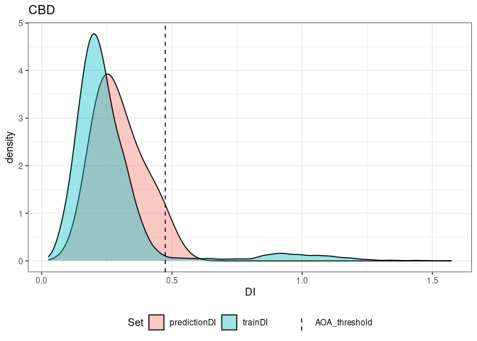

Predict Canopy Fuels at GEDI points
================
Johannes Heisig

- [Prep GEDI for prediction](#prep-gedi-for-prediction)
  - [Read and wrangle](#read-and-wrangle)
  - [Extract species label](#extract-species-label)
  - [Add fractional species coverage](#add-fractional-species-coverage)
- [Predict Random Forest](#predict-random-forest)
- [AOA](#aoa)

``` r
suppressPackageStartupMessages({
library(ggplot2)
library(dplyr)
select = dplyr::select
library(tidyr)
library(terra)
library(stars)
library(sf)
library(CAST)
library(caret)
library(ranger)
library(pbmcapply)
library(mapview)
})

source("R/modeling_helper_functions.R")
```

# Prep GEDI for prediction

## Read and wrangle

Species raster:

``` r
# species raster
species_codes = read.csv("data/Raster/tree_species_code.csv")
species_file = "data/Raster/species_10m.tif"
tree_spec = read_stars(species_file) |> 
  setNames("species") |> 
  mutate(species = factor(species, levels = species_codes$ID, 
                          labels = species_codes$name))
```

GEDI sample:

``` r
gedi = st_read("data/GEDI/GEDI_demo_subset.gpkg", quiet=T) |> 
    # add Above-ground Biomass with GEDI L4A equation for Europe
    mutate(AGBD = round(-96.53070068359375 + 7.175395488739014 * rh70 + 
                          2.9214682579040527 * rh98),
           year = as.numeric(substr(file, 10,13)),
           doy = as.numeric(substr(file, 14,16))) |> 
  drop_na() |> 
  st_transform(st_crs(tree_spec))
```

## Extract species label

``` r
gedi$species = st_extract(tree_spec, gedi) |> pull(1)
summary(gedi$species)
```

    ##       Birch       Beech Douglas_Fir         Oak       Alder      Spruce 
    ##           1           6           6          13           1           5 
    ##        Pine       Larch         Fir         ODH         ODL        NA's 
    ##           5          15           0           0           0           4

``` r
gedi = filter(gedi, !is.na(species))
```

## Add fractional species coverage

Use `exactextractr::exact_extract()` to calculate coverages within 25
meter diameter plots (GEDI footprint).

``` r
gedi_vect = buffer(vect(gedi), 12.5) |> st_as_sf()
gedi_vect$group = cut(1:nrow(gedi_vect), 70) |> as.numeric()

tree_spec_rast = rast(species_file) |> setNames("species")
tree_spec_rast[is.nan(tree_spec_rast$species)] <- NA
plot(as.factor(tree_spec_rast), col = rainbow(11))
```

<!-- -->

``` r
frac_coverage = exactextractr::exact_extract(tree_spec_rast, gedi_vect, 
                                             include_cols = "uniqueID",
                                             progress = F)
```

Transform fractions to new predictor variable, one for each species.
This parallel routine is designed for larger data volumes and may not be
necessary for this demo analysis.

``` r
in_list = make_even_groups(nrow(gedi), 4)   # groups for parallel processing
ext_par = pbmclapply(in_list, par_plot_frac, x = frac_coverage, mc.cores = 4)
ext_par = do.call(rbind, ext_par)  # aggregate to single dataframe
gedi = inner_join(gedi, ext_par)   # add fractions to GEDI measurements
```

    ## Joining with `by = join_by(uniqueID)`

# Predict Random Forest

Download Random Forest models from Zenodo if necessary.

``` r
dl_dir = "Modeling/point_level"
vars = c("CBD", "CBH", "CH", "CC", "CFL")

for(v in vars){
  f = paste0("rf_", v, ".rds")
  path = file.path(dl_dir, f)
  if (!file.exists(path)){
    message("Downloading ", f)
    url = paste0("https://zenodo.org/record/8288648/files/", f, "?download=1")
    download.file(url, path)
}}
```

``` r
gedi_pred = st_drop_geometry(gedi)  # remove spatial features for prediction
for(v in vars){
  f = paste0("rf_", v, ".rds")
  path = file.path(dl_dir, f)
  rf = readRDS(path)
  gedi = mutate(gedi, {{v}} := predict(rf, newdata = gedi_pred))
}

select(gedi, all_of(vars)) |> st_drop_geometry() |> summary()
```

    ##       CBD               CBH               CH              CC       
    ##  Min.   :0.02633   Min.   : 4.006   Min.   :16.73   Min.   :19.16  
    ##  1st Qu.:0.05410   1st Qu.: 6.604   1st Qu.:25.15   1st Qu.:32.79  
    ##  Median :0.06740   Median : 7.928   Median :27.31   Median :46.84  
    ##  Mean   :0.07230   Mean   : 7.910   Mean   :26.57   Mean   :50.73  
    ##  3rd Qu.:0.08866   3rd Qu.: 9.385   3rd Qu.:29.14   3rd Qu.:70.95  
    ##  Max.   :0.16115   Max.   :13.047   Max.   :33.04   Max.   :92.69  
    ##       CFL        
    ##  Min.   : 2.080  
    ##  1st Qu.: 5.891  
    ##  Median : 8.423  
    ##  Mean   : 9.366  
    ##  3rd Qu.:11.163  
    ##  Max.   :21.217

``` r
saveRDS(gedi, "Modeling/point_level/GEDI_canopy_fuel_predictions_RF.rds")
```

# AOA

Prepare parallel AOA computation.

``` r
t = readRDS("Modeling/point_level/train.rds") |> st_drop_geometry()
v = "CBD" # demo AOA for one variable

new = st_drop_geometry(gedi)
new$group = sample(1:4, nrow(new), replace = T) |> as.factor()
new_list = split(new, new$group)

model = readRDS(file.path(dl_dir, paste0("rf_", v, ".rds")))
method = "L2"   # Euclidean distance

vi = model$finalModel$variable.importance 
vi = t(vi) |> as.data.frame()
vrs = names(vi)
```

Calculate Dissimilarity Index of training data.

``` r
tdfile = paste0("Modeling/point_level/aoa/trainDI_RF_", v,".rds")
if (file.exists(tdfile)){
  td = readRDS(tdfile)
} else {
  td = trainDI(train = t, method = method, variables = vrs,  # takes ~ 3min
               weight = vi, CVtest = model$control$index)
  print(plot(td))
  saveRDS(td, tdfile)
}
```

Compute and merge AOA.

``` r
aoa_groups = pbmclapply(new_list, function(group){
  aoa = aoa(newdata = group, train = t, trainDI = td, weight = vi, 
            method = method, variables = vrs, CVtest = model$control$index)
  aoa$uniqueID = group$uniqueID
  return(aoa)
}, mc.cores = 4)

AOA = merge_aoa(aoa_groups)  # merge outputs from parallel process
AOA$AOA = factor(AOA$AOA, levels = c(0,1), labels = c("outside", "inside"))
table(AOA$AOA)
```

    ## 
    ## outside  inside 
    ##       2      50

Visualize.

``` r
print(plot(AOA, samplesize = nrow(gedi)) + ggtitle(v))
```

<!-- -->

``` r
gedi = inner_join(gedi, data.frame(aoa_cbd = AOA$AOA, uniqueID = AOA$uniqueID))
```

    ## Joining with `by = join_by(uniqueID)`

``` r
plot(gedi["aoa_cbd"], pch = 16, cex=2, pal = c(2,3), key.pos = 1)
```

<!-- -->
