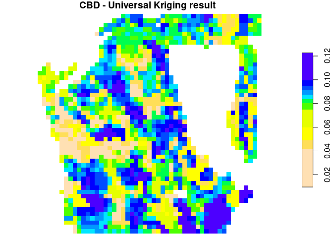

Interpolate Point-Level Canopy Fuels to Rasters Maps
================
Johannes Heisig

- [Setup](#setup)
- [Data and models](#data-and-models)
- [Interpolation](#interpolation)

``` r
suppressPackageStartupMessages({
library(stars)
library(sf)
library(gstat)
library(dplyr)
})
dir = "Modeling/interpolation"
```

## Setup

``` r
v = "CBD"  # Run demo for this single target variable
vars = c("CBD", "CBH", "SH", "CC", "CFL")
predvars = c(paste0("p_", vars[1:5]))
```

## Data and models

Covariate raster.

``` r
predictor_names = c("eosd", "bio","aspect", "dem", "slope", "length", "maxv", "minv",
                    paste0("MODIS_Traits_", c("LDMC","LNC","LPC","SLA")),
                    paste0("prep_S1_", c("VH", "VV", "VVVH")),
                    paste0("PS2_", c("HH", "HHHV","HV")),
                    paste0(c(rep("VH", 6), rep("VV", 6)),
                           rep(c(10, 10, 50, 50, 90, 90), 2), 
                           c("_asc", "_desc")),
                    paste0("S1_VVVH_", c("glcm_ASM", "glcm_contrast", "glcm_correlation", 
                            "glcm_dissimilarity", 
                            "glcm_entropy", "glcm_homogeneity", "glcm_mean", "glcm_variance")),
                    paste0("B", c(1:8, "8A", 9, 11, 12)) |> as.list() |>
                      purrr::map(rep, 3) |> unlist() |>
                      paste0("_", c("p10", "p50", "p90")),
                    paste0(c("EVI", "EVI2", "NDMI", "NDVI", "SAVI")) |>
                      as.list() |> purrr::map(rep, 3) |>
                      unlist() |> paste0("_", c("p10", "p50", "p90")),
                    "sosd", "species", "tprod")

r = read_stars("data/Raster/raster_covariates_demo.tif", proxy = F) |>  # proxy = T for large files
  split() |> setNames(predictor_names)

species_codes = read.csv("data/Raster/tree_species_code.csv")

tile_size = 26   # small demo tile size. can be much larger.
tiles = st_tile(nrow(r), ncol(r), tile_size, tile_size)
```

Download file(s) if necessary.

``` r
# model data
train_data_file = "LM_canopy_fuel_modeling_data.rds"
train_data_path = file.path(dir, "lm", train_data_file)
if (! file.exists(train_data_path)){
  options(timeout = 600)
  url = paste0("https://zenodo.org/record/8288648/files/", train_data_file, "?download=1")
  download.file(url, train_data_path)
}
# model
model_file = paste0("LM_", v, "_rf.rds")
model_path = file.path(dir, "lm", model_file)

if (! file.exists(model_path)){
  options(timeout = 600)
  url = paste0("https://zenodo.org/record/8288648/files/", model_file, "?download=1")
  download.file(url, model_path)
}
```

Linear model training data (demo subset).

``` r
train_lm = readRDS(train_data_path)
gedi = readRDS("Modeling/point_level/GEDI_canopy_fuel_predictions_RF.rds")

geom_train = as.character(train_lm$geometry)
index_train_gedi = which(geom_train %in% as.character(gedi$geom))
gedi_cov = train_lm[index_train_gedi, ]
```

Linear regression and variogram models.

``` r
model = readRDS(model_path)
identical(length(model$residuals), nrow(train_lm)) # matches train_lm
```

    ## [1] TRUE

``` r
gedi_cov$res = model$residuals[index_train_gedi] # add model residuals to demo data

frml = as.formula("res ~ 1")
vario = readRDS(file.path(dir, paste0("variograms/variogram_", v, "_rf.rds")))
vario_fit = vario$var_model
```

## Interpolation

Run Universal Kriging.

``` r
for (i in 1:nrow(tiles)){
  save_path = file.path(dir, paste0("output/rk_", v, "_", i, ".tif"))
  
  if (! file.exists(save_path)){
    
    message(paste0("Processing tile ", i))
    
    # safe tile reading with 5 trials
    tile = as.integer(1)
    counter = 1
    while(counter <= 5 && is.integer(tile)) {
      if (counter > 1){
        message(paste("Read tile: trial", counter))
        Sys.sleep(33)
      }
      tile = tryCatch(
        read_stars("data/Raster/raster_covariates_demo.tif", 
                   RasterIO = tiles[i, ], proxy = FALSE, NA_value = NA) |>
          units::drop_units() |>
          split() |>
          setNames(predictor_names) |>
          mutate(species = factor(species, levels = species_codes$ID, 
                                  labels = species_codes$name)), 
        error = function(e) e)
      if (inherits(tile, "error")) {
        print(tile)
        tile = as.integer(1)
      }
      counter = counter + 1
    }
    
    # skip if tile has no relevant data
    if(is.integer(tile)){
      message("Error: Could not read tile.")
      next
    }
    
    if (! all(is.na(tile$species))){
      
      # mask with species data
      tile[is.na(tile["species"])] = NA
      
      # ordinary residual kriging
      k = krige(frml, locations = gedi_cov, newdata = tile, 
                model = vario_fit, nmax = 100)
      
      # universal kriging
      k$lm_pred = predict(model, as.data.frame(tile))
      k = rename(k, okr_pred = var1.pred, okr_var = var1.var) |> 
        mutate(ukr = lm_pred + okr_pred) |>
        select(ukr, lm_pred, okr_pred, okr_var)
      
      # write
      write_stars(merge(k), save_path, NA_value = -9999, 
                  options = "COMPRESS=NONE", chunk_size = dim(tile))
      message("...done.")
    } else {
      message("...only NAs.")
    }
  }
}
```

Combine and visualize results.

``` r
outputs = list.files(file.path(dir, "output"), full.names = T)
mosaic_file = file.path(getwd(), dir, "mosaic_vrt.tif")

mosaic = st_mosaic(outputs, dst = mosaic_file)
mosaic = read_stars(mosaic_file) |> split(3) |>  
  setNames(c("UK", "LM_pred", "Kriging_Residuals", "Kriging_Var"))

plot(mosaic, main = paste0(v, " - Universal Kriging result"), col = rev(topo.colors(11)))
```

<!-- -->
