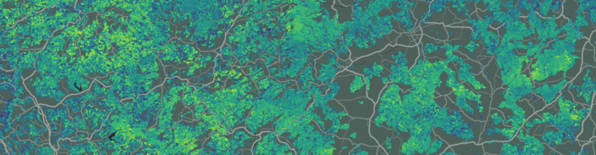

# Demo: High-Resolution Canopy Fuels for Germany based on GEDI

This repository contains code for the analysis in 

> Heisig, J., Milenković, M., Pebesma, E. (under review): High-Resolution Canopy Fuels for Germany based on GEDI.

The original analysis was conducted for Germany and produced 20 meter canopy fuels maps based on over 1.6 million GEDI points. Hence, data volumes and processing requirements are beyond the limits of simple reproducibility. Reference data, predictive models, and results can be downloaded from [**Zenodo**](https://zenodo.org/record/8288648). Canopy fuel variables can be explored interactively in a [**Google Earth Engine app**](https://ee-forestfuels-ger.projects.earthengine.app/view/gedi-fuels).

To demonstrate the methods we use a small (1x1 km) subset of the data. There are four analysis scripts in this folder, which can be run independently from each other. Scripts may download individual files from Zenodo if needed. Click the links below to view a pre-compiled version of the markdown files.

- [`01_EarthEngine_GEDI_data.Rmd`](R/01_EarthEngine_GEDI_data.md)

Query, filter, and download GEDI Level 2 A&B data (Google credentials required!). 

- [`02_Process_ALS_treelists_demo.Rmd`](R/02_Process_ALS_treelists_demo.md)

Clip, segment, and reduce LiDAR point clouds to derive tree-level structure metrics (tree list), which are used to obtain plot-level canopy fuel estimates (reference data).

- [`03_Point-level_predictions_demo.Rmd`](R/03_Point-level_predictions_demo.md)

Predict point-level canopy fuels with pre-trained Random Forest models.

- [`04_Interpolation.Rmd`](R/04_Interpolation.md)

Interpolate point estimates with biophysical raster covariates and Universal Kriging to produce 20-meter canopy fuels maps.
